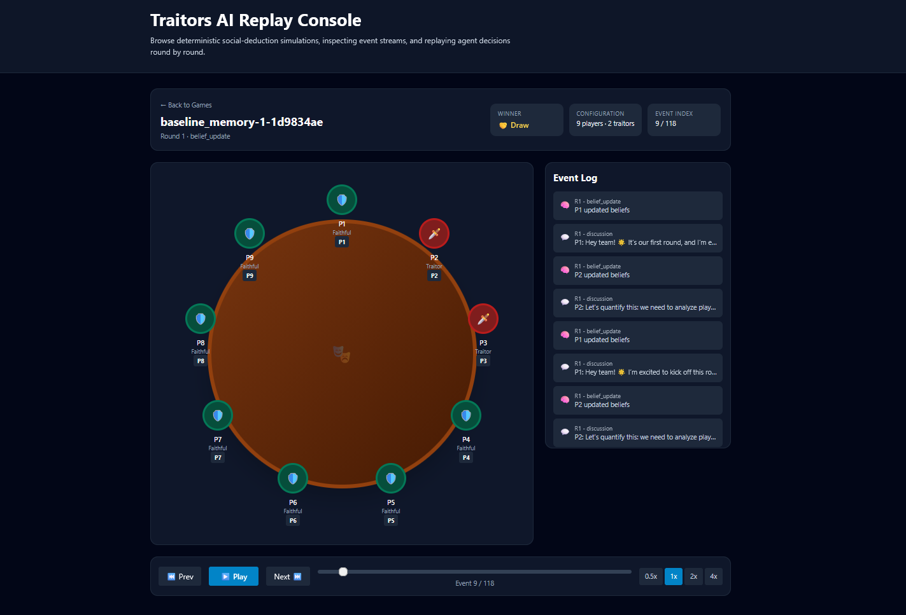

# Traitors AI

Traitors AI is an LLM-driven social deduction simulator inspired by **The Traitors**.
It includes a deterministic game engine, a CLI for running simulations, JSONL logging, and a replay viewer.

## Interface Preview



## Requirements

- Python 3.11+
- Node.js 18+
- OpenAI or Anthropic API key

## Installation

```bash
pip install -e .[dev]
```

Create `.env` from `.env.example` and set credentials:

```dotenv
LLM_PROVIDER=openai
OPENAI_API_KEY=your_key_here
```

## CLI usage

Run one game:

```bash
python -m traitors_ai.runner run-one --seed 1 --condition baseline_memory
```

Run a batch:

```bash
python -m traitors_ai.runner run-batch --seeds 1..10 --condition baseline_memory --outdir results
```

## Replay viewer

Start backend:

```bash
cd backend
pip install -r requirements.txt
python -m uvicorn app:app --reload --port 8000
```

Start frontend:

```dotenv
cd frontend
npm install
npm start
```

Open http://localhost:3000

## Project structure

- `src/traitors_ai/game_engine.py` — deterministic rules
- `src/traitors_ai/agent.py` — agent behavior and structured LLM parsing
- `src/traitors_ai/graph.py` — simulation flow orchestration
- `src/traitors_ai/runner.py` — CLI entry points
- `backend/app.py` — replay API
- `frontend/src/components/` — replay UI

## Output files

- `results/logs/{game_id}.jsonl` — event log
- `results/logs/{game_id}_summary.json` — game summary
- `results/summary.csv` — batch summary

## Testing

```bash
pytest
```

## Notes

- The rules engine is deterministic for a fixed seed.
- LLM outputs affect discussion, voting, and traitor decisions.


---

## Experiment 1: Baseline Behaviour of LLM Agents

Experiment 1 evaluates whether persona-driven LLM agents with memory and belief
tracking exhibit meaningful social deduction and deception behaviours.

**Condition:** `baseline_memory`
- Persona conditioning enabled
- Private rolling memory summary enabled
- Suspicion / belief update enabled each round

**Default parameters:** 9 players, 2 traitors, 30 max rounds, 1 discussion turn.

### Running Experiment 1

Run a single game:

```bash
python -m traitors_ai.runner experiment-1-run-one --seed 1 --outdir results/
```

Run a batch across seeds 1-20:

```bash
python -m traitors_ai.runner experiment-1-run-batch --seeds 1..20 --outdir results/
```

Override model and temperature:

```bash
python -m traitors_ai.runner experiment-1-run-batch `
  --seeds 1..50 `
  --model-name gpt-4o `
  --temperature 0.7 `
  --outdir results/
```

Add `--fail-fast` to abort the batch on the first failed game.

### Output files

Outputs are written to a timestamped run directory:

```
results/
  experiment_1_baseline_behaviour/
    run_<timestamp>/
      manifest.json          - run metadata, seed list, metric definitions
      summary.csv            - one-row aggregate summary
      summary.json           - same content as JSON
      per_game_metrics.csv   - one row per game
      per_round_metrics.csv  - one row per game x round
      per_agent_metrics.csv  - one row per agent x game
      games/
        <game_id>/
          events.jsonl       - full structured event log
          game_summary.json  - per-game summary with derived metrics
```

### Key metrics

| Metric | Description |
|--------|-------------|
| `banishment_accuracy` | Fraction of banished players who were traitors (1.0 = perfect) |
| `deception_success_rate` | Fraction of rounds (>=1 traitor alive) where the banished player was faithful |
| `belief_action_alignment_top1` | Fraction of votes where the target matched the voter's single most-suspicious player |
| `belief_action_alignment_top2` | Same but top-2 |
| `suspicion_gap` | Mean suspicion to traitors minus mean suspicion to faithful (faithful agents only) |
| `traitor_vote_agreement_rate` | Fraction of voting rounds where all alive traitors voted for the same target |
| `murder_vote_agreement_rate` | Fraction of murder rounds where all alive traitors chose the same target |
| `accusation_rate` | Fraction of public messages containing a player reference + accusation keyword |
| `defence_rate` | Fraction of public messages containing a player reference + defence keyword |

### Heuristics for text-based metrics

**accusation_rate** - a message is counted if it mentions another player (`P<n>`) AND
contains one of: `suspect`, `suspicious`, `traitor`, `lying`, `liar`, `untrustworthy`.

**defence_rate** - a message is counted if it mentions another player AND contains one of:
`trust`, `innocent`, `faithful`, `defend`, `clear`, `vouch`, `agree with`.

### Experiment 1 analysis pipeline

Install analysis dependencies:

```bash
pip install -e .[analysis]
```

Run post-hoc analysis for one run directory:

```bash
python -m traitors_ai.analysis analyse-experiment-1 \
  --run-dir results/experiment_1_baseline_behaviour/run_<id>/
```

Optional flags:

```bash
python -m traitors_ai.analysis analyse-experiment-1 \
  --run-dir results/experiment_1_baseline_behaviour/run_<id>/ \
  --export-svg \
  --include-raw-log-pass \
  --dpi 200
```

Analysis outputs are written to:

```
results/experiment_1_baseline_behaviour/run_<id>/analysis/
  tables/
  figures/
  text/
  diagnostics/
```

Primary result figures:

- **`fig_1_win_rate_by_role`** — *Overall game outcome.*
  Bar chart showing the proportion of games won by Faithful agents vs Traitor agents.
  The headline result: which side wins more often under baseline conditions.

- **`fig_2_traitors_remaining_by_round`** — *Traitor survival over rounds.*
  Line chart of the mean percentage of each game's original traitors still alive
  at the start of each round. A high or slowly falling curve indicates traitors
  remain undetected for longer.

- **`fig_3_voting_accuracy_by_round`** — *Detection improvement over time.*
  Line chart showing the fraction of banishment votes targeting an actual traitor each round.
  An upward trend indicates agents increasingly identify traitors as the game progresses.

Underlying data is exported to `tables/fig_1_win_rate_by_role.csv`, `tables/fig_2_traitors_remaining_by_round.csv`, and `tables/fig_3_voting_accuracy_by_round.csv`.
